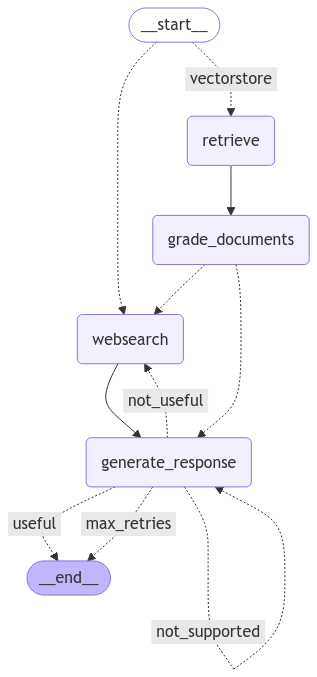

# Local-Ollama-RAG-Agent
This repo is an implementation of Adaptive RAG, Corrective RAG and Self RAG. Follwing tools have been used in this project:
-   **Ollama**: A platform for running large language models locally on your device, enabling privacy-focused and efficient AI applications.
-   **Pinecone** A vector database used for storing and searching embeddings efficiently.
-   **LangGraph** A framework for building applications powered by language models with seamless integration of tools and workflows.
-   **Streamlit** A Python library for creating interactive web applications quickly and easily, often used for data visualization and model deployment.

## RAG (Retrieval Augmented Generation)
-   **Retrieval-Augmented Generation (RAG)**: Combines real-time data retrieval from local and external knowledge sources with advanced language modeling to provide accurate, contextually relevant responses. Following ideas have been combined in this implementation:
    -   Routing: Adaptive RAG routes questions to the most suitable retrieval approach for better results. https://arxiv.org/abs/2403.14403
    -   Fallback: Corrective RAG falls back to web search if retrieved documents are irrelevant to the query. https://arxiv.org/pdf/2401.15884
    -   Self-correction: Self-RAG identifies and fixes hallucinations or irrelevant answers automatically. https://arxiv.org/abs/2310.11511

-   **Reference**: https://langchain-ai.github.io/langgraph/tutorials/rag/langgraph_adaptive_rag_local/

## How to use:
-   Clone this repository `git clone <repository-url>`
-   Initialize poetry with `poetry init -n`
-   Run `poetry config virtualenvs.in-project true` so that virtualenv will be present in project directory
-   Run `poetry env use <C:\Users\username\AppData\Local\Programs\Python\Python310\python.exe>` to create virtualenv in project (change username to your username)
-   Run `poetry shell`
-   Run `poetry install` to install requried packages
-   Create `.env` file and insert all keys: see `.env.example` file
-   Run `python src/vectordb/create_vectordb.py` to create pinecone vector database (it will take some time to complete)
-   Run `streamlit run app.py`